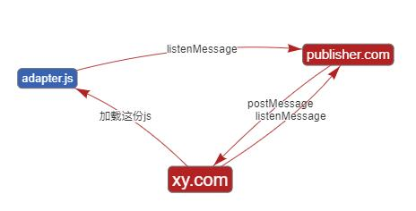

### 联运前端对接

联运方同学只需要提供一份js，其中监听了xyy-sdk的一系列事件回调, 在事件回调中书写自己的js交互逻辑即可



* [可以下载这份js文件模版](https://dwqdaiwenqi.github.io/xyy-sdk/page/down.html)

模版中内容如下：
```js
xyy.listenEventOn('createRole', function(data){
  console.log(data)
   // 联运gameid不必须？
   /**
   # 此处 data 的值为
   {
    uid: Number — 平台用户id

    server: Number — 区服id
    
    role: String — 区服名
    
    roleId: Number — 区服id

    sname: String — 区服名

    level: Number — 角色等级

    job: String — 职业
  
   }
   **/
})
xyy.listenEventOn('sendrole', function(data){
  console.log(data)
   /**
   # 此处 data 的值为
   {
    uid: Number — 平台用户id

    gid: Number — 游戏id
    
    sid: Number — 区服id
    
    roleid: Number — 角色id
   
   }
   **/

})
xyy.listenEventOn('sendchatlog', function(data){
  console.log(data)
  /**
   # 此处 data 的值为
   {
    serverid: Number — 区服id

    rolename: String — 角色名
    
    servername: String — 区服名
    
    channel: Number — 渠道id
    
    channelname: String — 渠道名
    
    ouid: Number — 
    
    content: String — 
    
    chattype: Number — 
    
    typename: Number — 
    
    platid: Number — 
    
    gameid: Number — 游戏id
    
    touserid: Number — 
    
    payamount: Number — 
    
    job: String — 职业
    
   }
   **/

})

xyy.listenEventOn('loginGameData', function(data){
  console.log(data)
  // 联运gid和rolename不是必须？
  /**
   # 此处 data 的值为
   {
    uid: Number — 平台用户id

    gid: Number — 游戏id
    
    sid: Number — 区服id
    
    roleid: Number — 角色id
    
    rolename: Number —角色名

    level:String — 角色等级
    
    job: String — 职业

   }
   **/
})

xyy.listenEventOn('upgrade', function(data){
  console.log(data)
  /**
   # 此处 data 的值为
    uid: Number — 平台用户id

    gid: Number — 游戏id
    
    sid: Number — 区服id
    
    roleid: Number — 角色id
    
    rolename: Number —角色名
    
    level: Number — 角色等级
    
    job: String — 职业
    
   }
   **/
})

xyy.listenEventOn('pay', function(data){
  console.log(data)
   /**
   # 此处 data 的值为
   {
    gid: Number — 游戏id

    uid: Number — 用户id
    
    appusername: String — 
    
    sid: String —  区服id
    
    openuid: Number — 
    
    porductid: Number — 职业
    
    resource: String —
    
    money: Number —
    
    app_order_id: Number —
    
    server_name: String —
    
    product_name: String —
    
    product_desc: String —
    
    job: String — 职业
    
   }
   **/
})

```
编写完成后，把这份文件给到xy游戏方

