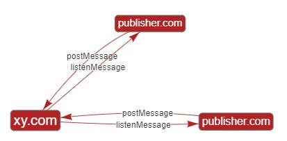

## xyy-sdk v1.0.8

我方xyy-sdk使用

### 引入
```html
<!-- 判断微信浏览器，并引入微信的sdk -->
<script>
if (/MicroMessenger/i.test(navigator.userAgent))
  document.write('<script src="//res.wx.qq.com/open/js/jweixin-1.2.0.js"><\/script>')
</script>
<!-- 注意xyy-sdk版本 如：xyy-sdk?1.0.1 -->
<script src="//static.xyimg.net/cn/static/h5/js/xyy-sdk.js?{x.y.z}"></script>

<!-- 游戏iframe中引入了xyy-sdk -->
<iframe src="/game"></iframe>
```

### 使用
```js
// 1、后端先为sdk输出一堆属性
xyy.gameId = '' 
xyy.uid  = ''
xyy.time = ''
xyy.isFocus = '';
xyy.username = ''
xyy.uswx = ''
xyy.token = ''
xyy.gameInfo = ''


// 2、再注册游戏对接事件
xyy.registerEvent()

// 3、监听游戏方的回调
xyy.listenEventOn('createRole', function(data){
  console.log(data)
   // 联运gameid不必须？
   /**
   # 此处 data 的值为 (同postMessage时传入的参数)
   {
    uid: Number — 平台用户id

    server: Number — 区服id
    
    role: String — 区服名
    
    roleId: Number — 区服id

    sname: String — 区服名

    level: Number — 角色等级

    job: String — 职业
  
   }
   **/
})
xyy.listenEventOn('sendrole', function(data){
  console.log(data)
   /**
   # 此处 data 的值为 (同postMessage时传入的参数)
   {
    uid: Number — 平台用户id

    gid: Number — 游戏id
    
    sid: Number — 区服id
    
    roleid: Number — 角色id
   
   }
   **/

})
xyy.listenEventOn('sendchatlog', function(data){
  console.log(data)
  /**
   # 此处 data 的值为 (同postMessage时传入的参数)
   {
    serverid: Number — 区服id

    rolename: String — 角色名
    
    servername: String — 区服名
    
    channel: Number — 渠道id
    
    channelname: String — 渠道名
    
    ouid: Number — 
    
    content: String — 
    
    chattype: Number — 
    
    typename: Number — 
    
    platid: Number — 
    
    gameid: Number — 游戏id
    
    touserid: Number — 
    
    payamount: Number — 
    
    job: String — 职业
    
   }
   **/

})

xyy.listenEventOn('loginGameData', function(data){
  console.log(data)
  // 联运gid和rolename不是必须？
  /**
   # 此处 data 的值为 (同postMessage时传入的参数)
   {
    uid: Number — 平台用户id

    gid: Number — 游戏id
    
    sid: Number — 区服id
    
    roleid: Number — 角色id
    
    rolename: Number —角色名

    level:String — 角色等级
    
    job: String — 职业

   }
   **/
})

xyy.listenEventOn('upgrade', function(data){
  console.log(data)
  /**
   # 此处 data 的值为 (同postMessage时传入的参数)
   {
    uid: Number — 平台用户id

    sid: Number — 区服id
    
    roleid: Number — 角色id
    
    rolename: Number —角色名
    
    level: Number — 角色等级
    
    job: String — 职业
    
   }
   **/
})

xyy.listenEventOn('pay', function(data){

   /**
   # 此处 data 的值为 (同postMessage时传入的参数)
   {
    gid: Number — 游戏id

    uid: Number — 用户id
    
    appusername: String — 用户名
    
    sid: String —  区服id
    
    openuid: Number — 用户游戏内id
    
    porductid: Number — 用户购买道具id
    
    resource: String — 联系开发人员获取
    
    money: Number — 金额(单位元)
    
    app_order_id: Number — 订单id
    
    server_name: String — 区服名
    
    product_name: String — 商品名
    
    product_desc: String — 商品描述
    
    job: String — 职业
    
   }
   **/
})

```

### xyy-sdk游戏对接事件逻辑

  

